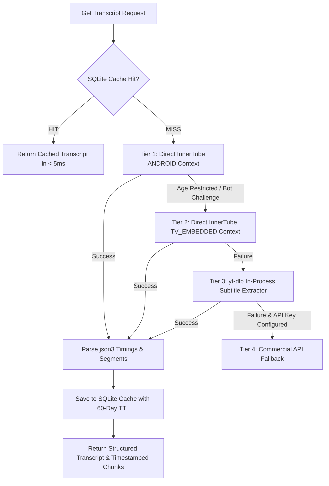

# YouTube Transcript & Caption Extraction: Deep Technical Comparison

## 1. Overview & Core Requirements

For deep AI research and RAG pipelines:
- Captions must **preserve exact millisecond timestamps** (`start`, `duration`, `end`).
- Auto-generated (ASR) and creator-uploaded (manual) captions must both be supported.
- On-the-fly translation must be supported via YouTube's timedtext translation engine (`&tlang=`).
- Cloud IP blocking (HTTP 429, PO-Tokens, 403 Forbidden) must be mitigated via tiered fallbacks.

---

## 2. Technical Comparison of Transcript Extraction Engines

| Method / Library | Latency (P50 / P95) | Word-Level Timings | Cloud IP Resilience | Age-Gated Support | Memory Footprint |
| :--- | :--- | :--- | :--- | :--- | :--- |
| **Direct InnerTube (`v1/player` + `timedtext json3`)** | **~150ms / ~300ms** ⚡ | **Yes (`json3` offsets)** | High (via `ANDROID` / `TV_EMBEDDED`) | Yes (`TVHTML5_SIMPLY_EMBEDDED_PLAYER`) | **~2 MB** |
| **`youtube-transcript-api`** | ~350ms / ~750ms | No (segments only) | Medium (frequent 429 on cloud IPs) | Requires login cookies | ~5 MB |
| **`yt-dlp` Subtitle Extraction (In-Process)** | ~1100ms / ~2400ms | Yes (`json3`) | **Highest (Multi-client fallback)** | High | ~60 MB |
| **`yt-dlp` CLI Subprocess** | ~2200ms / ~4200ms | Yes | High | High | ~120 MB |
| **Official YouTube Data API v3** | N/A | N/A | N/A | N/A | **Cannot download 3rd-party captions** (Requires channel owner OAuth) |
| **Commercial APIs (Supadata / SearchApi)** | ~300ms / ~800ms | Yes | 99.8% SLA | Managed | N/A (REST API) |

---

## 3. Deep Protocol Mechanics: Direct InnerTube + TimedText

### 3.1 InnerTube Player Endpoint
- **URL**: `POST https://www.youtube.com/youtubei/v1/player`
- **Client Emulation Contexts**:
  1. `ANDROID` (`clientName: "ANDROID"`, `clientVersion: "19.29.35"`) $\rightarrow$ Bypasses standard Web BotGuard checks.
  2. `TV_EMBEDDED` (`clientName: "TVHTML5_SIMPLY_EMBEDDED_PLAYER"`, `clientVersion: "2.0"`) $\rightarrow$ Bypasses age-gating without credentials.
  3. `WEB` (`clientName: "WEB"`, `clientVersion: "2.20240101.00.00"`) $\rightarrow$ Standard desktop response.

### 3.2 TimedText `json3` Format
Extract `captionTracks` from response $\rightarrow$ Append `&fmt=json3` to the track `baseUrl`:
```http
GET https://www.youtube.com/api/timedtext?v={video_id}&lang=en&fmt=json3
```
**Word-Level Event Payload Structure:**
```json
{
  "wireMagic": "pb3",
  "events": [
    {
      "tStartMs": 1420,
      "dDurationMs": 2880,
      "segs": [
        { "utf8": "When " },
        { "utf8": "we ", "tOffsetMs": 150 },
        { "utf8": "scale ", "tOffsetMs": 320 },
        { "utf8": "the context window...", "tOffsetMs": 750 }
      ]
    }
  ]
}
```

### 3.3 Free Instant Translation
Any track where `isTranslatable: true` can be translated instantly by appending `&tlang={lang_code}` (e.g. `&tlang=hi` for Hindi, `&tlang=es` for Spanish) without consuming extra LLM tokens.

---

## 4. Tiered Fallback Architecture for Transcripts


